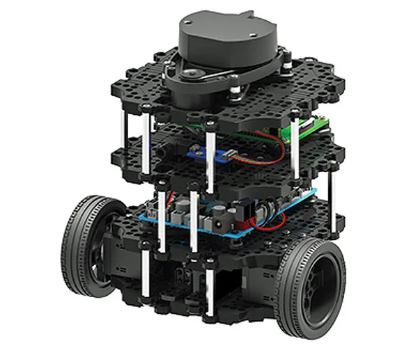

# TurtleBot3 – ROS 2 Autonomous Navigation Challenges

[](https://docs.ros.org/en/humble/)
[](https://opensource.org/licenses/Apache-2.0)


[](http://www.apache.org/licenses/LICENSE-2.0)

This repository contains the **complete navigation stack** used in the final ROS 2 project for the TurtleBot3 Burger.  
It implements three tightly-coupled challenges, plus two independent demo nodes, that together showcase vision-based line following, obstacle avoidance, and LIDAR corridor navigation.  

---

## 1  Package Contents

```
trajectoire/
├── launch/
│   └── full_challenges.launch.py     # Starts challenge1, challenge2, challenge3 in sequence
├── trajectoire/
│   ├── challenge1.py                 # Vision line‑following, roundabout, obstacle stop
│   ├── challenge2.py                 # Dual‑line tracking with dynamic obstacle avoidance
│   ├── challenge3.py                 # LIDAR-only corridor tracking
│   ├── challenge2V0.py               # Stand‑alone, simplified obstacle avoidance
│   └── balle.py                      # Ball tracking and goal scoring
├── package.xml
└── setup.py

projet2025/      # External simulation package (Gazebo world)

images/
├── robot.png                # Real robot photo
├── trajectory1.png     # Captured trajectory visualization-1
└── trajectory2.png     # Captured trajectory visualization-2
```
---

## 2  Quick Start (Developer PC)

```bash

# Clone and build only this package
# 1. Clone repository
cd ~/ros2_ws/src
git clone https://github.com/2ineddine/TurtleBot3-trajectory-challenges.git

# 2. Unzip and build projet2025 (Gazebo world)
cd ~/ros2_ws
colcon build --packages-select projet2025
source ~/.bashrc

# 3. Build trajectoire
colcon build --packages-select trajectoire
source install/setup.bash

```
You can follow the instructions from the repository below to set up your virtual ROS 2 development environment using Docker.

### Simulation

```bash
# Requires the projet2025 package (Gazebo world)
ros2 launch projet2025 projet.launch.py
# Then start the three‑stage pipeline
ros2 launch trajectoire full_challenges.launch.py
```

### Running Individual Nodes

```bash
ros2 run trajectoire challenge2V0
ros2 run trajectoire balle
```

---

## 3  Running on the Real TurtleBot3

| Terminal | Commands |
|----------|----------|
| 1 & 2 (robot) | `ssh turtle@192.168.0.123` <br> `zenoh-bridge-ros2dds` |
| 3 (robot) | `ssh turtle@192.168.0.123` <br> `ros2 launch turtlebot3_bringup robot.launch.py` |
| 4 (PC) | `zenoh-bridge-ros2dds -e tcp/192.168.0.123:7447` |
| 5 (PC) | `ros2 launch trajectoire full_challenges.launch.py` |

Zenoh bridges DDS traffic between the robot and PC, allowing PC-side vision nodes to control the robot via `/cmd_vel`.

---

## 4  Challenge Descriptions

### 4.1  Challenge 1 – Line Following and Roundabout
* Camera + OpenCV HSV thresholding to detect red & green floor lines.  
* Keeps the robot centred, handles a roundabout (left or right) based on a parameter, and stops on sudden obstacles.

### 4.2  Challenge 2 – Active Obstacle Avoidance
* Continues line following but dynamically steers around two obstacles in the lane.  
* Uses LIDAR side sectors to select the free direction, crosses one line if necessary, and recentres afterwards.

### 4.3  Challenge 3 – LIDAR Corridor Navigation
* Only uses LIDAR.  
* Maintains equal distance to left and right walls, exits corridor when forward space is clear or side opening is detected.  
* The node self‑terminates with `rclpy.shutdown()` once the corridor is finished.

### 4.4  Independent Nodes
* **challenge2V0.py** – minimal demo of obstacle avoidance + line following.  
* **balle.py** – tracks a tennis ball and pushes it through a red‑post goal.

---

## 5  Robot & Roadmap





---


## 6  External References

This project reuses material and builds upon ideas from the following public repositories:

- [ROS and Experimental Robotics](https://github.com/sylarevan/ROS_and_Experimental_Robotics) — Tutorial code and educational examples
- [docker-ros2-desktop-vnc](https://github.com/sylarevan/docker-ros2-desktop-vnc) — Docker container for running full ROS 2 desktop environments with GUI and Gazebo support

Special thanks to **Sylvain Argentieri**, HDR and Maître de conférences at Sorbonne University,  
for making these resources publicly available and pedagogically accessible.

---
## 7  Authors
Maintainer: 2ineddine - zbou6599@gmail.com  
---
